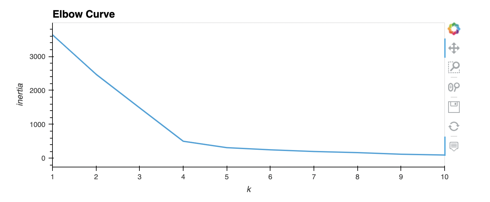
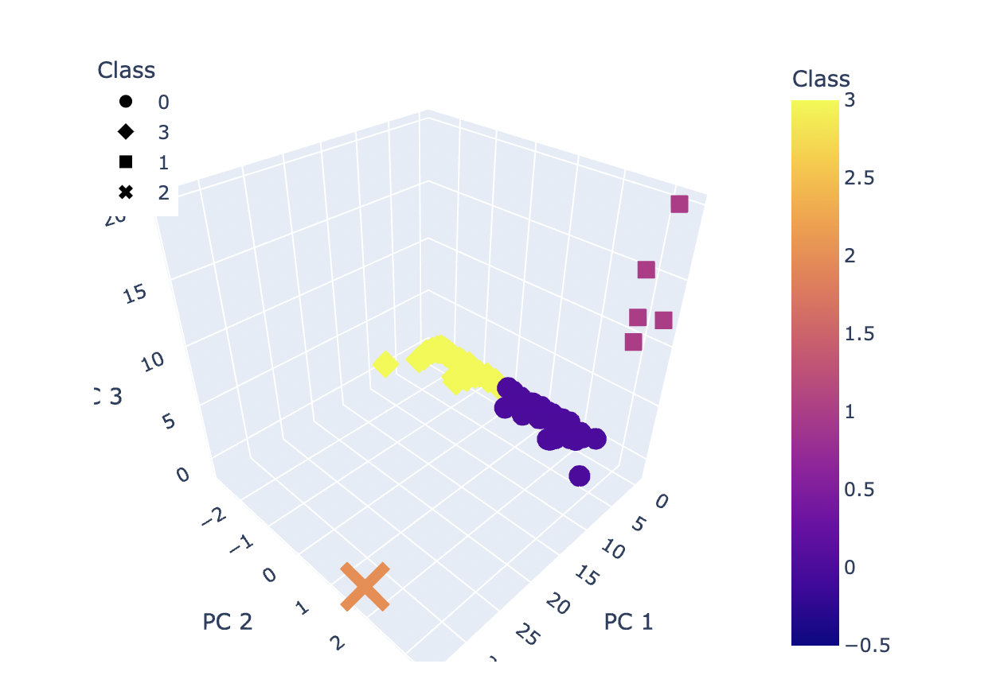
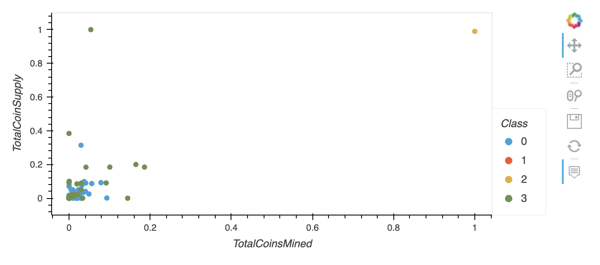

# Cryptocurrencies

## Overview

The purpose of this project is to use unsupervised machine learning to analyze a database of cryptocurrencies and create a report including the traded cryptocurrencies classified by group according to their features.
This classification report could be used by an investment bank to propose a new cryptocurrency investment portfolio to its clients.

We use the following methods for the analysis:

- preprocessing the database,
- reducing the data dimension using Principal Component Analysis,
- clustering cryptocurrencies using K-Means,
- visualizing classification results with 2D and 3D scatter plots.

## Resources:

Data Source: crypto_data.csv, CryptoCompare
Software: Python 3.7.7, Anaconda Navigator 1.9.12, Conda 4.8.4, Jupyter Notebook 6.0.3

## Results 

Elbow Curve

3D-Scatter plot

2D-Scatter plot 

## Summary:

We  have identified the classification of 532 cryptocurrencies based on similarities of their features.
Particularities of each group need to be analyzed to determined their performance and potential interest for the investment bank's clients
